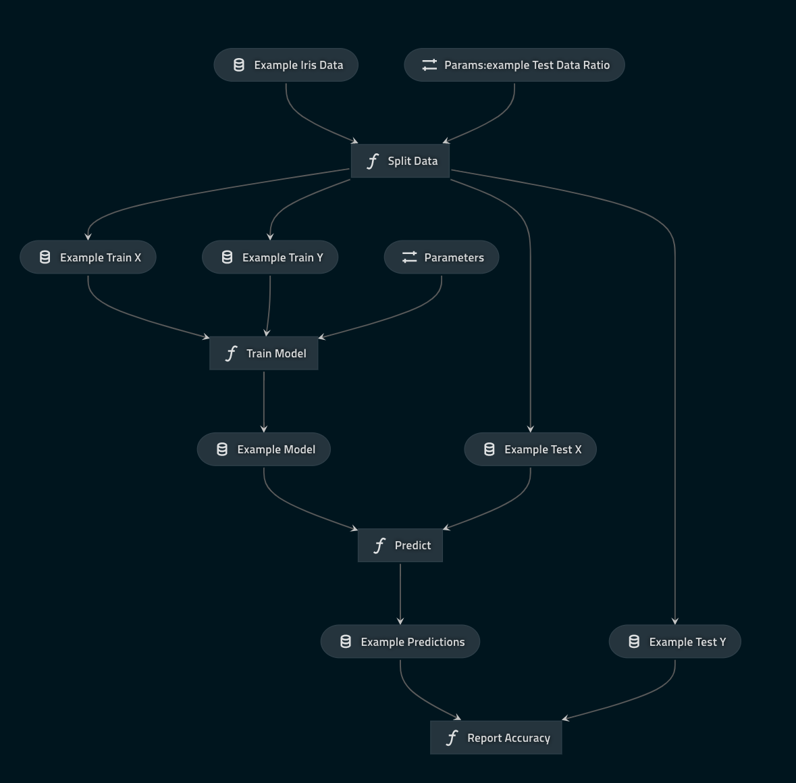

# The `kedro-tdsp-starter` Kedro starter 

## Introduction

The code in this repository demonstrates best practice when working with Kedro. It contains a Kedro starter template with some initial configuration and documentation from the [Azure TDSP project](https://docs.microsoft.com/en-us/azure/machine-learning/team-data-science-process/overview).

### An example machine learning pipeline using only native `Kedro`

Above is an example pipeline using the common iris dataset. It contains the code for an example machine learning pipeline that trains a random forest classifier to classify an iris. 

The pipeline includes two modular pipelines: one for data engineering and one for data science.

The data engineering pipeline includes:

* A node to split the transformed data into training dataset and testing dataset using a configurable ratio

The data science pipeline includes:

* A node to train a simple multi-class logistic regression model
* A node to make predictions using this pre-trained model on the testing dataset
* A node to report the accuracy of the predictions performed by the model
